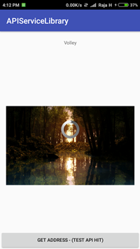
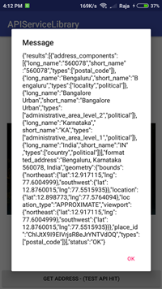

# Minimized API Service Library
   This is a optimized custom library for server communication. References taken from Official VOLLEY library.
   We can reduce the code for making api calls when using this library. All references are taken from Google's Official Volley.
   
  
# Features:

   1. Added custom listeners to handle the responses in easy way
   2. Added Progress bar when getting response from server.(can disable by passing false in request parameter)  
   3. Success and Failure are captured in Logcats(Log.Info)  
   4. Circular imageview implemented in NetworkImageView.(NetworkImageView is from volley)
   5. Used API TAGS to identify multiple requests from single activity.
   6. Added ResponseHeaders params in response
  
  
                                   
  
# Usage

Step 1:
 import apiservice module into your project and add the following code for api communication.

 [Donwload module])https://github.com/Rajagopalr3/APIServiceLibrary/blob/master/apiservices-1.3.aar

Step 2:
 Implement ActivityResponseListener on activity for getting success & failure response from server

(or)

# Gradle Depedencies :

```

dependencies {
    implementation 'com.libRG.volley:apiservices:1.3'
}


```

# Implementation Steps in Activity File

```

public class MainActivity extends AppCompatActivity implements ActivityResponseListener{

  @Override
    protected void onCreate(Bundle savedInstanceState) {
        super.onCreate(savedInstanceState);
        setContentView(R.layout.activity_main);
        
        //Setting authentication tokens for request - set this code into base activity

        //HashMap<String, String> headerParams = new HashMap<>();
        //headerParams.put("key", "value");
        //ApiService.setHeaders(headerParams);
        
        sendRequest();
    }

 private void sendRequest() { // tag is used to identify the API requests - when multiple requests are used.
        String url = "http://maps.googleapis.com/maps/api/geocode/json?address=560078";
        ApiService.StringRequest(this, 1, url, null, "GET_ADDRESS", true);
    }
    
  public void setImage(String imageURL, ImageView imageView) {
  
        ApiService.getImageLoader(this).get(imageURL, ImageLoader.getImageListener(imageView, R.mipmap.ic_launcher_round,                                                                                                  R.mipmap.ic_launcher));
 }
    
    
  @Override
    public <T> void onResponse(T response, String tagName, JSONObject responseHeaders) {//responseHeaders is used to catch the network                                                                                              header params like auth key and value
        
        if (tagName.equals("GET_ADDRESS")) {
        Toast.makeText(getApplicationContext(), response.toString(), Toast.LENGTH_SHORT).show();
        }
        
    }

    @Override
    public void onError(Object error, String tagName) {
        Toast.makeText(getApplicationContext(), error.toString(), Toast.LENGTH_SHORT).show();
    }
    
}


```

APIServiceLibrary Provides variety of implementations of Request.

1. StringRequest  
2. JsonObjectRequest  
3. JsonArrayRequest
3. MultiPartRequest  
4. ImageRequest  

# Explanation of code:

```
   HashMap<String, String> input  =new HashMap<String, String>() 
   input.put("key", "value");
   
   ApiService.StringRequest(this, 1, url, input, "GET_ADDRESS", true);
    
   StringRequest & JSONObjectRequest method Params :
    
   1. this           -->   It is used receive the callback from server response.(passing context to intialize the request)
   2. 0 or 1         -->   This is request type either POST or GET etc.(should pass integer values)
   3. url            -->   This is request url of server
   4. input          -->   Pass request input parameters based on method types(GET or POST, if GET method pass null)
                           (if JSON request pass json input else pass formdata)
   5. GET_ADDRESS    -->   This is Request TAG to identify and validate the specific response from server
   6. true           -->   This is used to show progress bar when getting data from server.(pass false if not required)
   
   
 # Setting authentication tokens for request - set this code at once
 
        HashMap<String, String> headerParams = new HashMap<>();
        headerParams.put("key", "value");
        ApiService.setHeaders(headerParams);
   

```

# References taken from Google's Volley Library
   I have optimized the API request code to reduce the code implementation for api call. I used volley for server commmunication.
   Thanks to Volley

 # License
 
 ```
 
Copyright 2017 Rajagopal

Licensed under the Apache License, Version 2.0 (the "License");
you may not use this file except in compliance with the License.
You may obtain a copy of the License at

   http://www.apache.org/licenses/LICENSE-2.0

Unless required by applicable law or agreed to in writing, software
distributed under the License is distributed on an "AS IS" BASIS,
WITHOUT WARRANTIES OR CONDITIONS OF ANY KIND, either express or implied.
See the License for the specific language governing permissions and
limitations under the License.
 
 
```  


  
  
 
  
